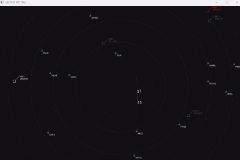

# vector-atc

### A minimalist ATC Simulation Platform Using C++ and SFML (with built-in AI for ATC)

## Core Features (Current)
- Aircraft with realistic dynamics: position, velocity, heading, turn rates, climb/descent
- Basic airspace boundaries and conflict detection setup (CPA basics in progress)
- SFML 2D radar-style rendering: trails, labels, range rings
- Modular structure: aircraft, airspace, dynamics, and vectorBrain for decision logic
- Built with Visual Studio + CMake for easy(ish) builds
--
## Tech Stack
- **Language**: Modern C++ (C++17/20 vibes)
- **Graphics & Input**: SFML (bundled in include/ & lib/)
- **Build**: CMake + Visual Studio project files (.sln/.vcxproj)
- Math: Vector ops, trig, basic physics integration
--
## Roadmap:  
- Rule-based brain first  
- Log data for training  
- Tiny C++ NN + backprop  
- RL episodes in sim  
- Show AI takeover

## GIFS
  

